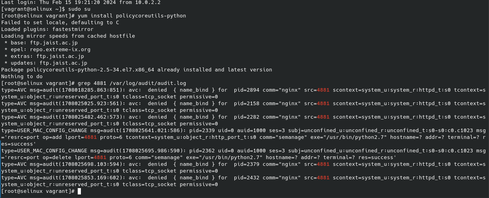
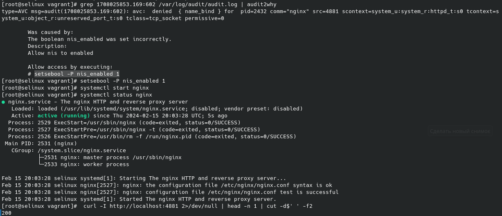
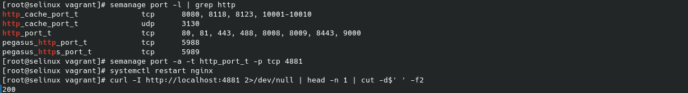
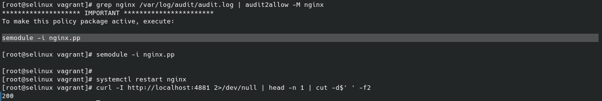
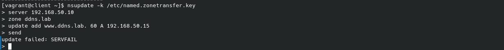
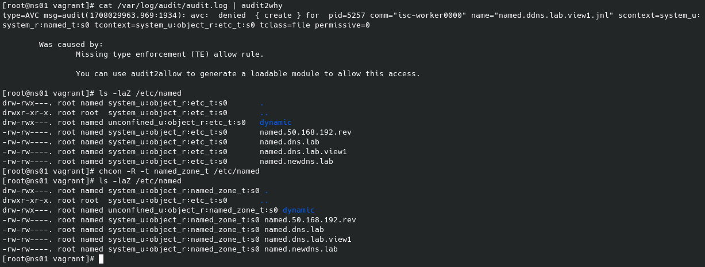
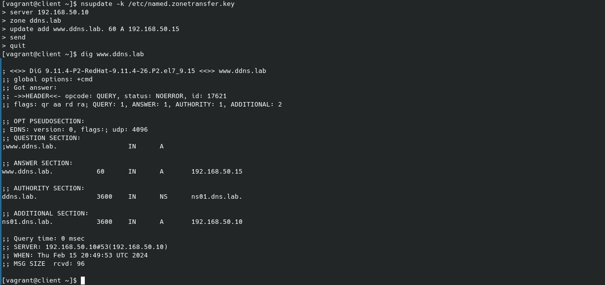

#SELinux
Задание 1

Запустить nginx на нестандартном порту 3-мя разными способами

Необходимо запустить nginx на нестандартном 4881 порту 3-мя разными способами.
SELinux в целях безопасности блокирует запуск nginx т.к. используется не стандартный порт.

- 1 способ
  при помощи переключателей setsebool включить 
- 2 способ
  при помощм добавления нестандартного порта в имеющийся тип 
- 3 способ
  при помощи формирования и установки модуля 

Задание 2

Обеспечение работоспособности приложения при включенном SELinux на примере dns

При изменении dns зоны клиентом происходит , из за неправильного контекста безопастности каталога с размещаемой зоной на . После изменения контекста запись зоны проходит 
